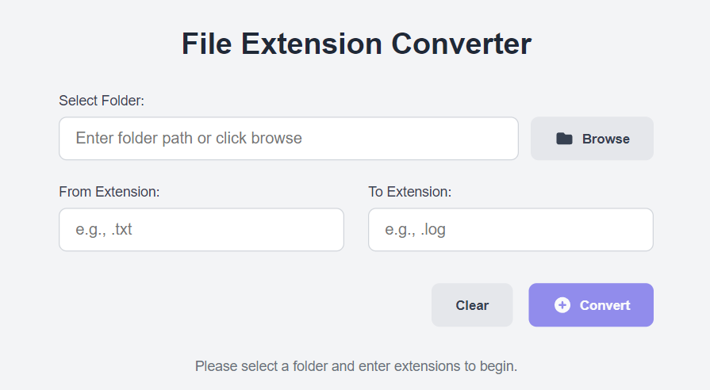

# File-Extension-Converter
A desktop app to convert all files in a chosen directory from one file extension to another.

## Installation and Running
1. Install [Python 3.11.9](https://www.python.org/downloads/release/python-3119/), checking "Add Python to PATH".
2. Download `File-Extension-Converter-main.zip` from here(https://github.com/Revelmonger/File-Extension-Converter/archive/refs/heads/main.zip) and extract its contents.
3. Install the required dependencies by running the `installRequirments.bat`.
4. Start the app by running the `runApp.bat`

## Known Issues
- There is currently a bug where the "setHighDpiScaleFactorRoundingPolicy" enviroment variable doesn't get set properly. This seems to be a known issue with some PyQt6 versions.
